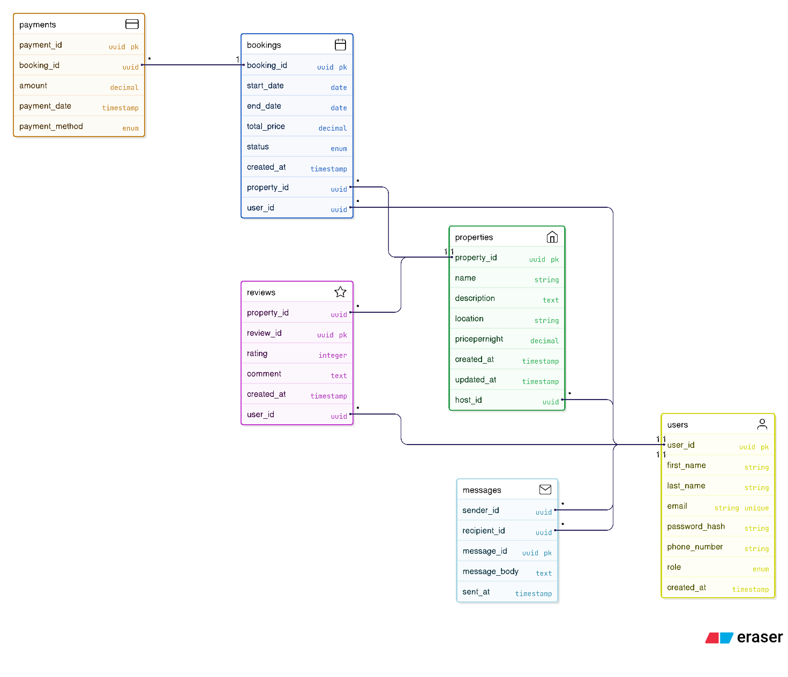

# ALX Airbnb - ER Diagram Requirements

This document outlines the entities, attributes, and relationships for the ALX Airbnb database. This serves as the foundation for the visual ER Diagram.

**Note:** This is a generic model. You *must* adapt this to your project's specific requirements.

## 1. Entities and Attributes

### User
* `user_id` (Primary Key): Unique identifier for the user.
* `email`: User's email (Unique, Not Null).
* `password_hash`: Hashed password (Not Null).
* `first_name`: User's first name.
* `last_name`: User's last name.
* `phone_number`: User's contact number.
* `created_at`: Timestamp of account creation.

### Property
* `property_id` (Primary Key): Unique identifier for the property.
* `host_id` (Foreign Key -> User): The user who owns/lists the property.
* `title`: Title of the listing.
* `description`: Detailed description (TEXT).
* `address`: Physical address.
* `city`: City.
* `country`: Country.
* `property_type`: e.g., 'Apartment', 'House', 'Guest House'.
* `price_per_night`: Cost per night (DECIMAL).
* `max_guests`: Maximum number of guests (INTEGER).
* `bedrooms`: Number of bedrooms.
* `bathrooms`: Number of bathrooms.
* `created_at`: Timestamp of listing creation.

### Booking
* `booking_id` (Primary Key): Unique identifier for the booking.
* `guest_id` (Foreign Key -> User): The user who made the booking.
* `property_id` (Foreign Key -> Property): The property being booked.
* `check_in_date`: Start date of the booking (DATE).
* `check_out_date`: End date of the booking (DATE).
* `total_price`: The total calculated price for the stay (DECIMAL).
* `status`: e.g., 'Pending', 'Confirmed', 'Cancelled' (ENUM type).
* `booked_at`: Timestamp of when the booking was made.

### Review
* `review_id` (Primary Key): Unique identifier for the review.
* `booking_id` (Foreign Key -> Booking): The booking this review is for (can be UNIQUE).
* `guest_id` (Foreign Key -> User): The user who wrote the review.
* `property_id` (Foreign Key -> Property): The property being reviewed.
* `rating`: Star rating (e.g., 1-5) (INTEGER).
* `comment`: The review text (TEXT).
* `created_at`: Timestamp of review submission.

## 2. Relationships

* **User to Property (Hosting):**
    * A `User` can *own* (host) **zero or many** `Properties`.
    * A `Property` is *owned* by **exactly one** `User`.
    * (One-to-Many: `User` <-> `Property`)

* **User to Booking (Guesting):**
    * A `User` (as a guest) can *make* **zero or many** `Bookings`.
    * A `Booking` is *made* by **exactly one** `User`.
    * (One-to-Many: `User` <-> `Booking`)

* **Property to Booking:**
    * A `Property` can *have* **zero or many** `Bookings`.
    * A `Booking` is *for* **exactly one** `Property`.
    * (One-to-Many: `Property` <-> `Booking`)

* **Booking to Review:**
    * A `Booking` can *have* **zero or one** `Review`. (Assuming one review per stay).
    * A `Review` is *for* **exactly one** `Booking`.
    * (One-to-One: `Booking` <-> `Review`)

* **User/Property to Review (Direct):**
    * A `Review` is *written* by **one** `User` and is *about* **one** `Property`. This relationship is implicitly handled via the `Booking` table.

## 3. ER Diagram

*(You will create this diagram in Draw.io or a similar tool and export it as an image, e.g., `airbnb_erd.png`)*

