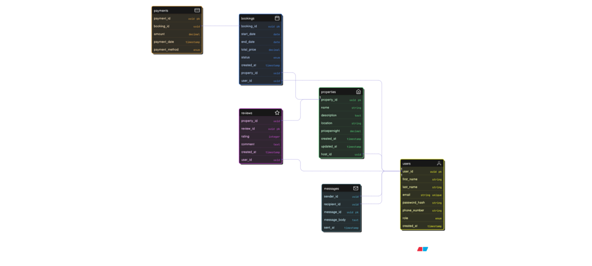

# 🚀 ALX Airbnb Database Module

Welcome to the ALX Airbnb Database project! This repository contains the complete database module, from conceptual design to a fully populated, runnable SQL database. This file serves as the central documentation for the entire project.

## 🗺️ 1. DataScape & ER Diagram

The Entity-Relationship (ER) Diagram provides a high-level, visual blueprint of our database. It defines the "what" (our data entities) and the "how" (their relationships).

**Note:** The image below is a placeholder. You should upload the `airbnb_erd.png` image I generated for you into the `ERD/` directory for this link to work.



<details>
<summary><strong>View Entities & Attributes</strong> (Click to expand)</summary>

### 👤 User
* `user_id` (Primary Key): Unique identifier for the user.
* `email`: User's email (Unique, Not Null).
* `password_hash`: Hashed password (Not Null).
* `first_name`: User's first name.
* `last_name`: User's last name.
* `phone_number`: User's contact number.
* `created_at`: Timestamp of account creation.

### 🏠 Property
* `property_id` (Primary Key): Unique identifier for the property.
* `host_id` (Foreign Key -> User): The user who owns/lists the property.
* `title`: Title of the listing.
* `description`: Detailed description (TEXT).
* `address`: Physical address.
* `city`: City.
* `country`: Country.
* `property_type`: e.g., 'Apartment', 'House', 'Guest House'.
* `price_per_night`: Cost per night (DECIMAL).
* `max_guests`: Maximum number of guests (INTEGER).
* `bedrooms`: Number of bedrooms.
* `bathrooms`: Number of bathrooms.
* `created_at`: Timestamp of listing creation.

### 🗓️ Booking
* `booking_id` (Primary Key): Unique identifier for the booking.
* `guest_id` (Foreign Key -> User): The user who made the booking.
* `property_id` (Foreign Key -> Property): The property being booked.
* `check_in_date`: Start date of the booking (DATE).
* `check_out_date`: End date of the booking (DATE).
* `total_price`: The total calculated price for the stay (DECIMAL).
* `status`: e.g., 'Pending', 'Confirmed', 'Cancelled' (ENUM type).
* `booked_at`: Timestamp of when the booking was made.

### ⭐ Review
* `review_id` (Primary Key): Unique identifier for the review.
* `booking_id` (Foreign Key -> Booking): The booking this review is for (Unique).
* `guest_id` (Foreign Key -> User): The user who wrote the review.
* `property_id` (Foreign Key -> Property): The property being reviewed.
* `rating`: Star rating (e.g., 1-5) (INTEGER).
* `comment`: The review text (TEXT).
* `created_at`: Timestamp of review submission.

</details>

<details>
<summary><strong>View Relationships</strong> (Click to expand)</summary>

* **User to Property (Hosting):**
    * A `User` can *own* (host) **zero or many** `Properties`.
    * A `Property` is *owned* by **exactly one** `User`.
    * (One-to-Many: `User` <-> `Property`)

* **User to Booking (Guesting):**
    * A `User` (as a guest) can *make* **zero or many** `Bookings`.
    * A `Booking` is *made* by **exactly one** `User`.
    * (One-to-Many: `User` <-> `Booking`)

* **Property to Booking:**
    * A `Property` can *have* **zero or many** `Bookings`.
    * A `Booking` is *for* **exactly one** `Property`.
    * (One-to-Many: `Property` <-> `Booking`)

* **Booking to Review:**
    * A `Booking` can *have* **zero or one** `Review`. (This is enforced by a unique constraint on `booking_id` in the `Reviews` table).
    * A `Review` is *for* **exactly one** `Booking`.
    * (One-to-One: `Booking` <-> `Review`)

</details>

---

## ✨ 2. Database Normalization (3NF)

To ensure our database is efficient, scalable, and free of errors, we've normalized it to the **Third Normal Form (3NF)**.

* **1NF (First Normal Form):** All column values are atomic (indivisible). We've done this (e.g., we don't store "WiFi, Pool" in a single `amenities` column).
* **2NF (Second Normal Form):** All non-key attributes fully depend on the entire primary key. Our single-column primary keys (like `user_id`) automatically satisfy this.
* **3NF (Third Normal Form):** We have no *transitive dependencies*.

**What's a Transitive Dependency?**
It's when a non-key column depends on *another* non-key column, not on the primary key.

* **Bad Design:** `Properties(property_id, host_id, host_email)`
* **Problem:** `host_email` depends on `host_id`, which depends on `property_id`. This is a transitive dependency. If a host's email changes, we'd have to update it on *every property they own*.
* **3NF Solution (Our Design):** We move `host_email` where it belongs:
    * `Users(user_id, email, ...)`
    * `Properties(property_id, host_id, ...)`

Now, `email` is only stored once in the `Users` table. We find it by joining the tables. This eliminates redundancy and prevents update errors.

---

## 🏗️ 3. Database Schema (DDL)

The **DDL (Data Definition Language)** script creates the *structure* of our database. It builds the empty tables, columns, constraints, and indexes.

<details>
<summary><strong>View `schema.sql` Code</strong> (Click to expand)</summary>

```sql
-- Drops all tables if they exist to ensure a clean slate.
-- CASCADE drops any dependent objects (like views or foreign key constraints).
DROP TABLE IF EXISTS Reviews CASCADE;
DROP TABLE IF EXISTS Bookings CASCADE;
DROP TABLE IF EXISTS Properties CASCADE;
DROP TABLE IF EXISTS Users CASCADE;

-- Create an ENUM type for booking status for data consistency.
DROP TYPE IF EXISTS booking_status;
CREATE TYPE booking_status AS ENUM ('Pending', 'Confirmed', 'Cancelled');

-- Table: Users
-- Stores information about all users (both hosts and guests).
CREATE TABLE Users (
    user_id SERIAL PRIMARY KEY,
    email VARCHAR(255) UNIQUE NOT NULL,
    password_hash VARCHAR(255) NOT NULL,
    first_name VARCHAR(100) NOT NULL,
    last_name VARCHAR(100) NOT NULL,
    phone_number VARCHAR(50) UNIQUE,
    created_at TIMESTAMZ DEFAULT CURRENT_TIMESTAMP
);

-- Table: Properties
-- Stores all property listings.
CREATE TABLE Properties (
    property_id SERIAL PRIMARY KEY,
    host_id INT NOT NULL,
    title VARCHAR(255) NOT NULL,
    description TEXT,
    address VARCHAR(255) NOT NULL,
    city VARCHAR(100) NOT NULL,
    country VARCHAR(100) NOT NULL,
    property_type VARCHAR(50),
    price_per_night DECIMAL(10, 2) NOT NULL CHECK (price_per_night > 0),
    max_guests INT NOT NULL CHECK (max_guests > 0),
    bedrooms INT DEFAULT 1 CHECK (bedrooms >= 0),
    bathrooms INT DEFAULT 1 CHECK (bathrooms >= 0),
    created_at TIMESTAMZ DEFAULT CURRENT_TIMESTAMP,
    
    -- Foreign key constraint linking to the host (User)
    CONSTRAINT fk_host
        FOREIGN KEY(host_id) 
        REFERENCES Users(user_id)
        ON DELETE CASCADE -- If a user is deleted, their properties are also deleted.
);

-- Table: Bookings
-- Stores information about reservations made by users.
CREATE TABLE Bookings (
    booking_id SERIAL PRIMARY KEY,
    guest_id INT NOT NULL,
    property_id INT NOT NULL,
    check_in_date DATE NOT NULL,
    check_out_date DATE NOT NULL,
    total_price DECIMAL(10, 2) NOT NULL,
    status booking_status DEFAULT 'Pending' NOT NULL,
    booked_at TIMESTAMZ DEFAULT CURRENT_TIMESTAMP,
    
    -- Foreign key for the guest (User)
    CONSTRAINT fk_guest
        FOREIGN KEY(guest_id) 
        REFERENCES Users(user_id)
        ON DELETE CASCADE, -- If a guest user is deleted, their bookings are deleted.
    
    -- Foreign key for the property
    CONSTRAINT fk_property
        FOREIGN KEY(property_id) 
        REFERENCES Properties(property_id)
        ON DELETE CASCADE, -- If a property is deleted, its bookings are deleted.
        
    -- Check constraint to ensure logical dates
    CONSTRAINT check_dates CHECK (check_out_date > check_in_date)
);

-- Table: Reviews
-- Stores reviews submitted by guests for properties after a stay.
CREATE TABLE Reviews (
    review_id SERIAL PRIMARY KEY,
    booking_id INT UNIQUE NOT NULL, -- Ensures one review per booking
    guest_id INT NOT NULL,
    property_id INT NOT NULL,
    rating INT NOT NULL CHECK (rating >= 1 AND rating <= 5),
    comment TEXT,
    created_at TIMESTAMZ DEFAULT CURRENT_TIMESTAMP,
    
    -- Foreign keys
    CONSTRAINT fk_booking
        FOREIGN KEY(booking_id)
        REFERENCES Bookings(booking_id)
        ON DELETE CASCADE,
    CONSTRAINT fk_guest
        FOREIGN KEY(guest_id)
        REFERENCES Users(user_id)
        ON DELETE SET NULL, -- If guest account is deleted, keep the review anonymously
    CONSTRAINT fk_property
        FOREIGN KEY(property_id)
        REFERENCES Properties(property_id)
        ON DELETE CASCADE -- If property is deleted, delete its reviews
);

-- --- INDEXES ---
-- Create indexes on foreign keys and common search columns for performance.

-- On Users table
CREATE INDEX idx_users_email ON Users(email);

-- On Properties table
CREATE INDEX idx_properties_host_id ON Properties(host_id);
CREATE INDEX idx_properties_city_country ON Properties(city, country);
CREATE INDEX idx_properties_price ON Properties(price_per_night);

-- On Bookings table
CREATE INDEX idx_bookings_guest_id ON Bookings(guest_id);
CREATE INDEX idx_bookings_property_id ON Bookings(property_id);

-- On Reviews table
CREATE INDEX idx_reviews_guest_id ON Reviews(guest_id);
CREATE INDEX idx_reviews_property_id ON Reviews(property_id);
